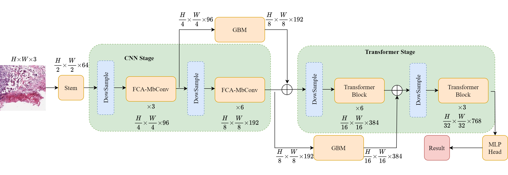
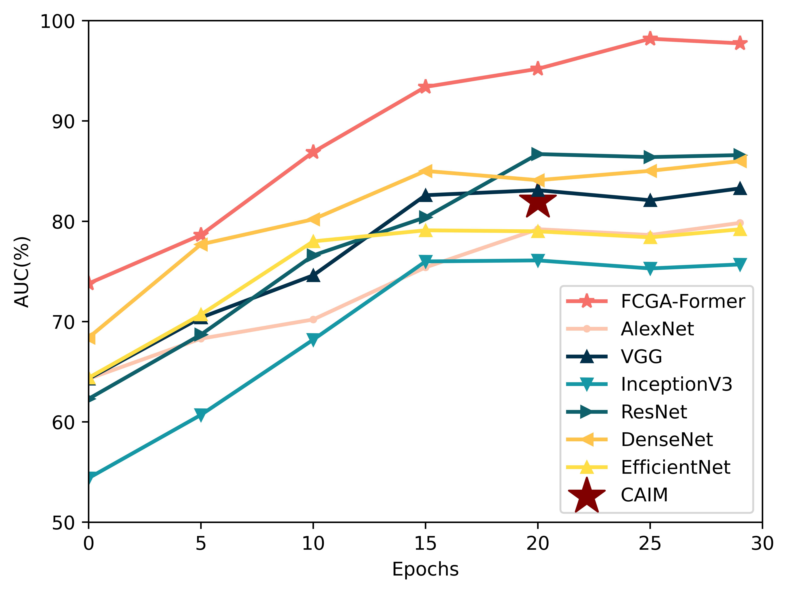
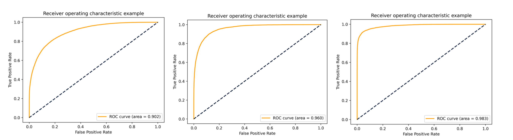
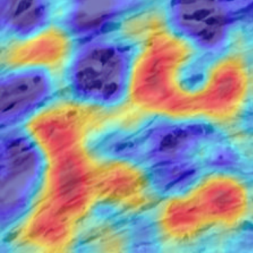
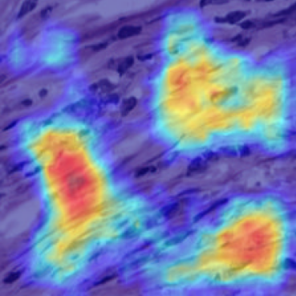
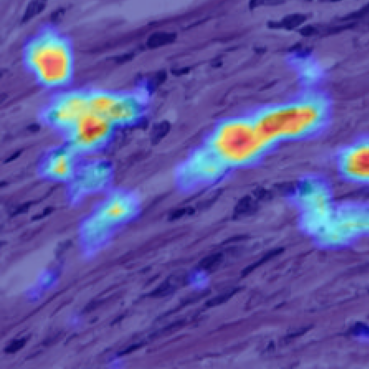

# FCGA-Former: A Hybrid Classification Model for Predicting the Tumor Mutation Burden of Lung Adenocarcinoma

#### a project about deep learning to predict the tumor mutation burden of lung adenocarcinoma . 
***
### **Model**

***

### **The result of FCGA-Former**

#### Comparison with convolution network 

#### Comparison with transformer network 

***

### **Structure and Running**
    dataprocessing:
            1.0b_tileLoop_deepzoom4.py --Split all svs files 
            2.0d_SortTiles2.py --Classify by label 
    model:
            1.FCGA-Former --the proposed model
            2.FCGA-Former-CAM.py --Grad-CAM for FCGA-Former
            3.others model

    source activate python_env

    pip install -r requestments.txt

    python train.py

### **CAM**
***

Grad-CAM of attention module about FCGA-Former 

the left is CA attention,the middle is cbam attention,the right is se attention.

